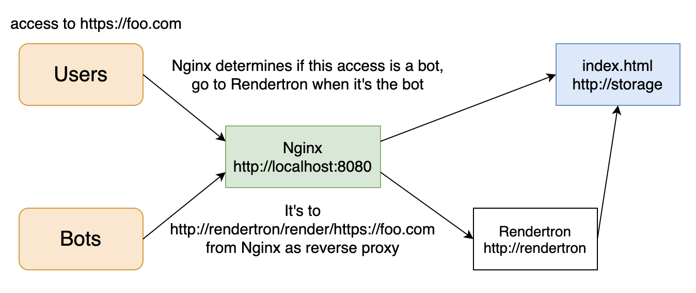
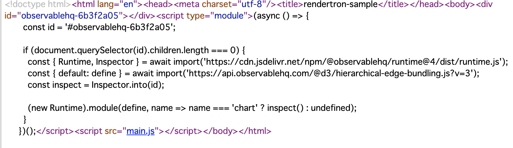
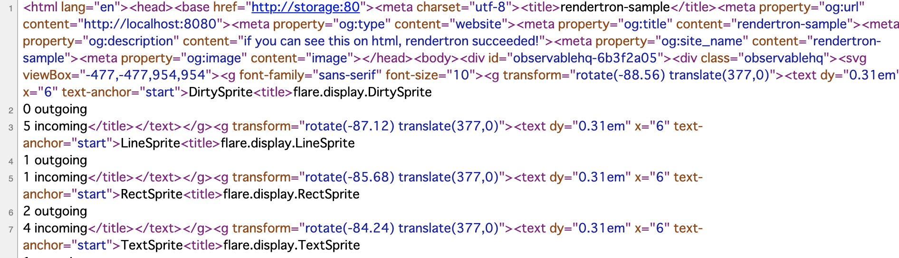
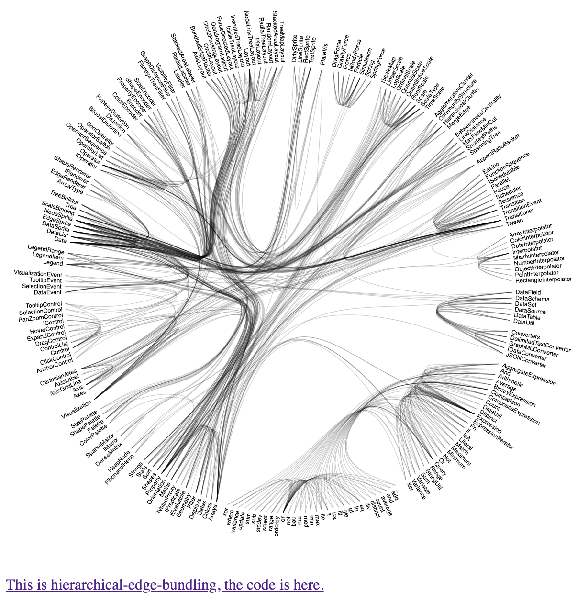
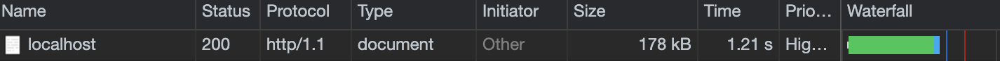

# A minimum sample of Dynamic Rendering

This project uses [rendertron](https://github.com/GoogleChrome/rendertron) for dynamic rendering. 

## Infrastructure



## Result

When users access to this repo, this repo will return this html



but when bots access the same url, this html will be this.



It means if you use dynamic rendering, SEO will be safety and OGP will enable, even if you don't write Node.js code.

Also, this output is like this.



This code using d3.js is too huge but rendertron was able to render as SSR.



### Performance 

For users

```shell
ᐅ wrk -t12 -c20 -d30s http://127.0.0.1:8080
Running 30s test @ http://127.0.0.1:8080
  12 threads and 20 connections
  Thread Stats   Avg      Stdev     Max   +/- Stdev
    Latency    14.29ms    5.46ms 115.34ms   69.84%
    Req/Sec    70.07     16.31   171.00     67.17%
  25217 requests in 30.06s, 23.81MB read
Requests/sec:    838.91
Transfer/sec:    811.02KB
```

For bots

```shell
ᐅ wrk -t12 -c20 -d30s http://127.0.0.1:8080
Running 30s test @ http://127.0.0.1:8080
  12 threads and 20 connections
  Thread Stats   Avg      Stdev     Max   +/- Stdev
    Latency     0.00us    0.00us   0.00us     nan%
    Req/Sec     0.00      0.00     0.00    100.00%
  68 requests in 30.10s, 31.74MB read
  Socket errors: connect 0, read 0, write 0, timeout 68
Requests/sec:      2.26
Transfer/sec:      1.05MB
```

## Debug

```sh
$ git clone git@github.com:hiroppy/dynamic-rendering-sample.git
$ cd dynamic-rendering-sample
$ docker-compose up --build
$ open http://localhost:8080
```